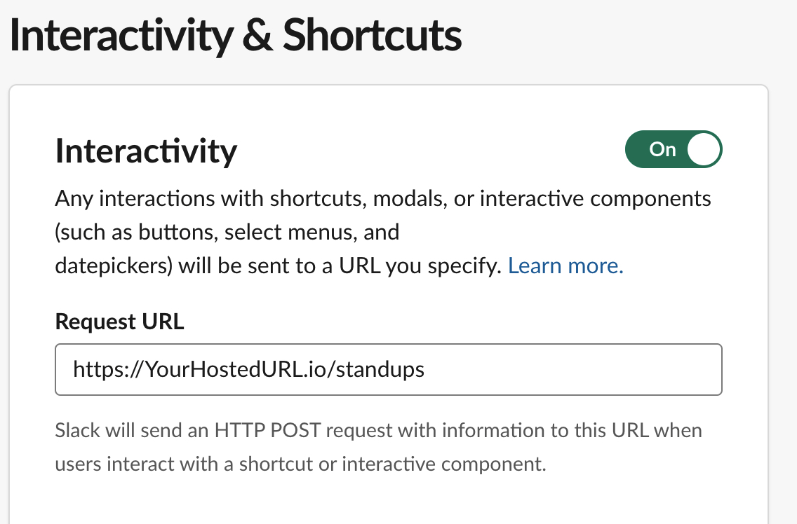
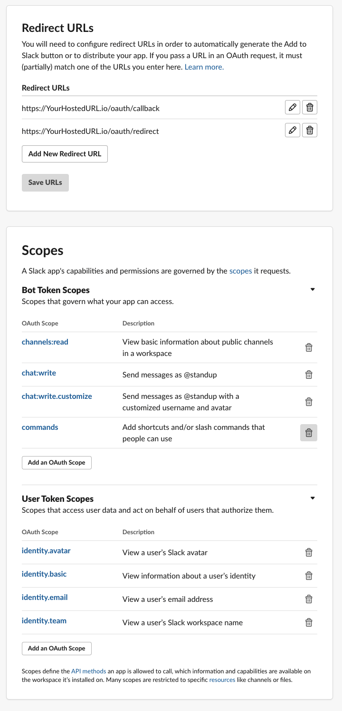
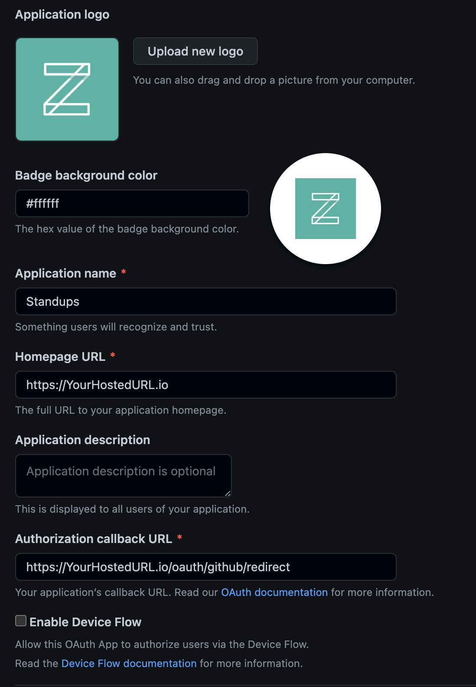
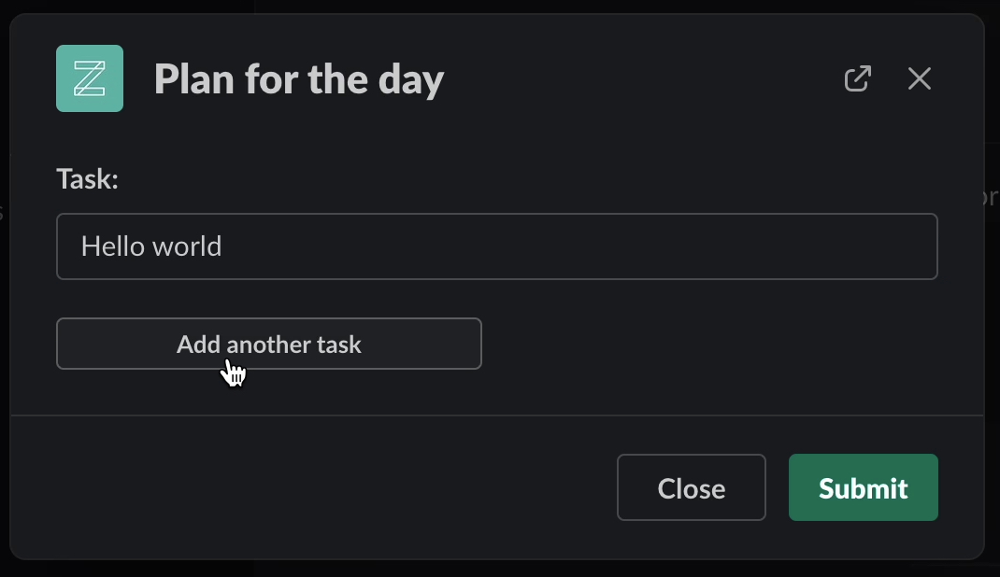
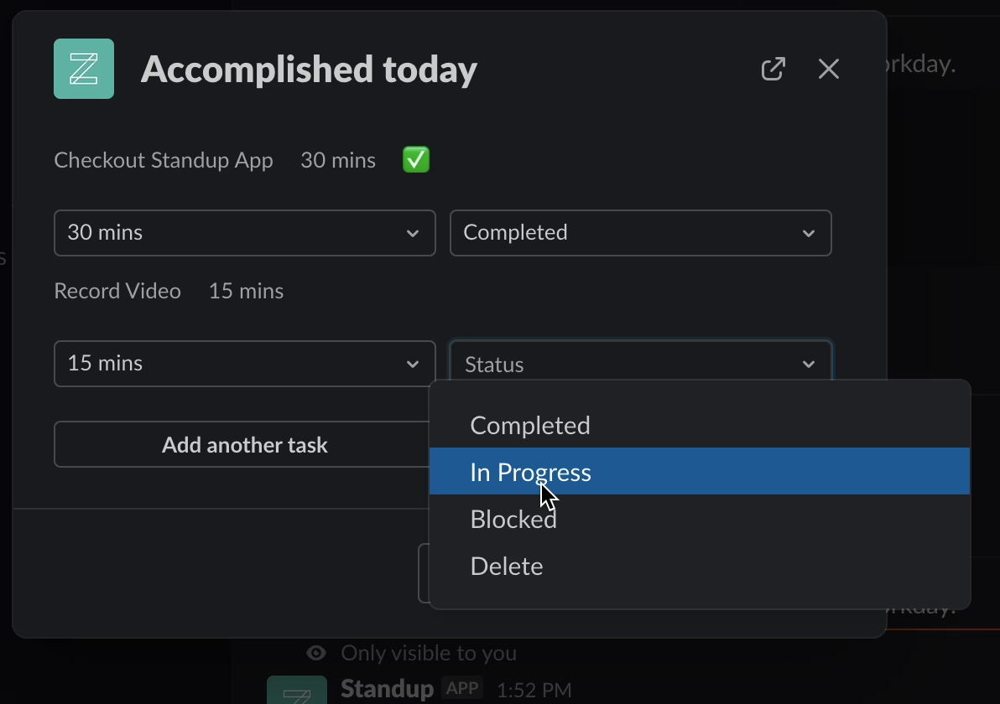

# Standup

Standup is a task tracking web app used to communicate between Slack and GitHub.

## Installation

### Slack

Slack app setup guide: [Slack Api Guide](https://api.slack.com/apps?new_app=1)

After Slack app is created, updated .env file with app keys.
Updated Slack App setting with the following:

###GitHub

GitHub app setup guide:
[Apps](https://docs.github.com/en/developers/apps)

After GitHub app is created, use App keys to updated .env file.
Updated Homepage and Auth call back to hosted url.

## Usage

## License
[MIT](https://choosealicense.com/licenses/mit/)
